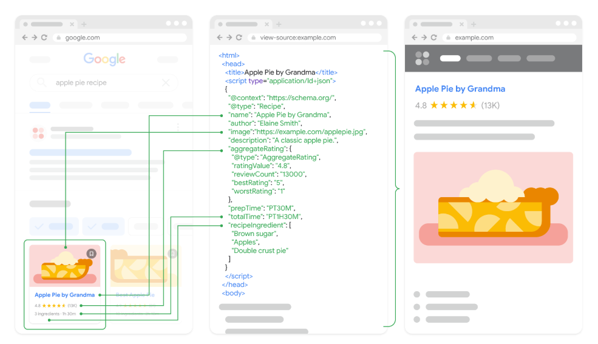

# Social Metadata Optimization

This guide helps you enhance how your website appears when shared on social media using **Schema.org microdata**, **Open Graph Protocol**, and **Twitter Cards**.

---

## 📷 Visual Example of Structured Data

The image below shows how structured data (in JSON-LD format) connects your website content to rich previews in search and social platforms.



---

## 1. Schema.org Microdata (for Google Search / Google+)

Schema.org microdata provides structured data to help search engines understand your content. It lives directly in the HTML body.

### Example:

```html
<div itemscope itemtype="http://schema.org/Article">
  <h1 itemprop="name">Enjoy Fireworks</h1>
  <p itemprop="description">Fireworks are beautiful. This article explains how beautiful fireworks are.</p>
  
</div>
```

**Key Attributes:**

- `itemscope`: Defines the scope of the item.  
- `itemtype`: Specifies the type using schema.org vocabulary.  
- `itemprop`: Describes properties such as name, description, and image.

**Validation:**

- [Google Rich Results Test](https://search.google.com/test/rich-results)

---

## 2. Open Graph Protocol (for Facebook, LinkedIn, etc.)

Open Graph (OGP) metadata resides in the `<head>` of your HTML and is used for generating link previews.

### Example:

```html
<meta property="og:title" content="Enjoy Fireworks">
<meta property="og:description" content="Fireworks are beautiful. This article explains how beautiful fireworks are.">
<meta property="og:image" content="https://example.com/fireworks.jpg">
<meta property="og:url" content="https://example.com/enjoy-fireworks">
<meta property="og:type" content="article">
```

**Key Properties:**

| Property          | Description                         |
|------------------|-------------------------------------|
| `og:title`       | Title of the page                   |
| `og:description` | Short summary                       |
| `og:image`       | Image URL                           |
| `og:url`         | Canonical URL of the page           |
| `og:type`        | Type of content (website, article)  |

**Validation:**

- [Facebook Debugger](https://developers.facebook.com/tools/debug/)

---

## 3. Twitter Cards (for Twitter)

Twitter Cards extend Open Graph and allow Twitter to attach rich media.

### Example:

```html
<meta name="twitter:card" content="summary_large_image">
<meta name="twitter:title" content="Enjoy Fireworks">
<meta name="twitter:description" content="An article about the beauty of fireworks.">
<meta name="twitter:image" content="https://example.com/fireworks.jpg">
<meta name="twitter:site" content="@yourhandle">
```

**Key Tags:**

| Name                  | Description                                  |
|-----------------------|----------------------------------------------|
| `twitter:card`        | Type of card (summary, summary_large_image) |
| `twitter:title`       | Title of the content                         |
| `twitter:description` | Short description                            |
| `twitter:image`       | Image URL                                    |
| `twitter:site`        | Twitter username (e.g. @yourhandle)          |

**Validation:**

- [Twitter Card Validator](https://cards-dev.twitter.com/validator)

---

## ✅ Best Practices

- Use **all three metadata formats** — they work together and provide broader compatibility.
- 📸 Use **high-quality images**:
  - Facebook/OGP: 1200×630 px  
  - Twitter: 1200×628 px
- 🔗 Always use **absolute URLs**.
- 🧾 Include a standard `<meta name="description">` for general SEO.
- 🔁 Define `<link rel="canonical">` for consistent sharing.

---

## 🧠 Complete Example in `<head>`

```html
<head itemscope itemtype="http://schema.org/Article">
  <meta charset="utf-8">
  <meta name="viewport" content="width=device-width, initial-scale=1">
  <title>Enjoy Fireworks</title>
  <meta name="description" content="Fireworks are beautiful. This article explains how beautiful fireworks are.">

  <!-- Open Graph -->
  <meta property="og:title" content="Enjoy Fireworks">
  <meta property="og:description" content="Fireworks are beautiful. This article explains how beautiful fireworks are.">
  <meta property="og:image" content="https://example.com/fireworks.jpg">
  <meta property="og:url" content="https://example.com/enjoy-fireworks">
  <meta property="og:type" content="article">

  <!-- Twitter Card -->
  <meta name="twitter:card" content="summary_large_image">
  <meta name="twitter:title" content="Enjoy Fireworks">
  <meta name="twitter:description" content="An article about the beauty of fireworks.">
  <meta name="twitter:image" content="https://example.com/fireworks.jpg">
  <meta name="twitter:site" content="@yourhandle">

  <!-- Microdata Image -->
  <link itemprop="image" href="https://example.com/fireworks.jpg">
</head>
```

---

## 🔗 References

- [Schema.org](https://schema.org)
- [Open Graph Protocol](https://ogp.me)
- [Twitter Developer Docs](https://developer.twitter.com/en/docs/twitter-for-websites/cards/overview/abouts-cards)
